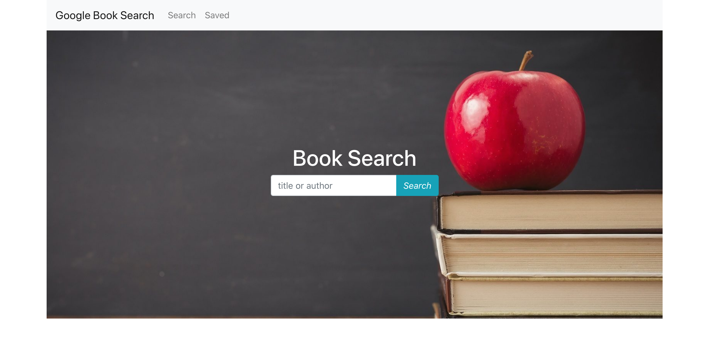
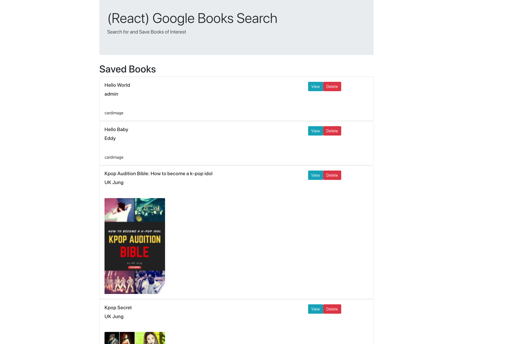

# Book Search
book search is an application that querys google books api for what ever books you search for. Optionally you can save or delete books from your saved books.

## Software specifications
- typing on search bar returns a list of books
- must be able to save book for later
- must be able to delete books
- clicking on save books tab lists all books saved

## Technologies used
- mongoDB
- Mongoose
- bootstrap
- react

## Screenshots

# Links
[Live site](https://ernest-urzua-book-search.herokuapp.com/)
